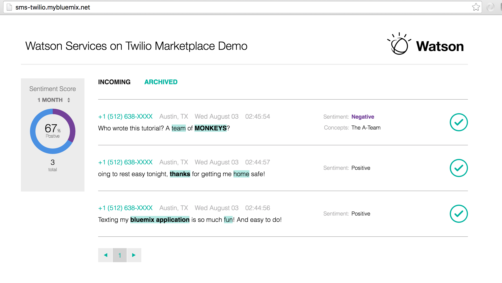

# Watson Services on Twilio Marketplace Demo App

A demo app that uses the `IBM Watson Message Insights` and the `IBM Watson Message Sentiment` add-ons for Twilio.

## Overview

TODO

This app demonstrates how quickly you can build an app on Bluemix using the Watson Add-ons for Twilio service.

## Application Requirements
You can use this app in any browser.

## Run the app on Bluemix
You can deploy your own instance of the demo app to Bluemix.

1. Create a Bluemix Account.

    [Sign up][bluemix_signup_url] for Bluemix, or use an existing account.

2. Download and install the [Cloud-foundry CLI][cloud_foundry_url] tool.

3. Clone the app to your local environment from your terminal using the following command:

  ```
  git clone https://github.com/cognitive-catalyst/twilio.git
  ```

4. `cd` into this newly created directory.

5. Install the required npm packages using the following command:

  ```
  npm install
  ```

6. Build your app with the following command:

  ```
  npm run build
  ```

7. Edit the `manifest.yml` file and change the `<uname>` and `<uname>` to something unique.

  ```
  applications:
  -  name: <uname>
     host: <uname>
     buildpack: python_buildpack
     path: .
     domain: mybluemix.net
     instances: 1
     memory: 256M
  ```
  The host you use will determinate your application URL initially, for example, `<uname>.mybluemix.net`.

8. Connect to Bluemix in the command line tool and follow the prompts to log in:

  ```
  cf api https://api.ng.bluemix.net
  cf login
  ```

9. First we need to create a MySQL Database instance. We will be using the ClearDB Spark Plan which is free and can hold up to 5 MB of data with 4 simultaneous connections. **Note**: You might need to target a space by selecting a space or by using the `cf target -s SPACE` command.

  ```
  cf create-service cleardb spark mysql-twilio-instance
  ```

10. Push the demo app to Bluemix. You need to perform additional steps when it is deployed, so you must add the option --no-start argument.

  ```
  cf push --no-start
  ```

11. Now, bind the service to your app. **Note**: The name <uname> must be updated to reflect the name that you chose in step 5.

  ```
  cf bind-service <uname> mysql-twilio-instance
  ```

12. Finally, start your app. You can also do this from the Bluemix dashboard. **Note**: The name <uname> must be updated to reflect the name that you chose in step 5.

  ```
  cf start <uname>
  ```

Congratulations! You now have your very own instance of the Twilio demo app running on Bluemix.
After you connect it to your Twilio service, you can 
try it out at `https://<uname>.mybluemix.net`, where <uname> is the value that you set in your `manifest.yml` file.

## Run the app locally

1. If don't have node.js already, [download node.js][download_node_url] and install it on your local machine.

2. Clone the app to your local environment from your terminal using the following command:

  ```
  git clone https://github.com/cognitive-catalyst/twilio.git
  ```

3. `cd` into this newly created directory.

4. Install the required npm packages using the following command:

  ```
  npm install
  ```

5. Build your app with the following command:

  ```
  npm run build
  ```

6. Set the mysql database credentials in the `config.json` file:

  ```
    {
        "credentials": {
            "name": "twilio",
            "hostname": <hostname>,
            "port": "3306",
            "username": <username>,
            "password": <password>
        }
    }
  ```

7. Run your app with the following command:

  ```
  python server.py
  ```

Now, go to `localhost:PORT` in your browser (for example, PORT is 8888 in the example above).

## Configure Twilio

1. [Create a Twilio Account](https://www.twilio.com/try-twilio)
2. Navigate to the [Programmable SMS services page](https://www.twilio.com/console/sms/services) and click on "Create new Messaging Service"
3. From the configure pane, put "http://\<your-app-name\>.mybluemix.net/api/message" as the Request Url 
4. Navigate to the numbers pane and Buy a Number
5. Add the IBM Watson Message Insights and the IBM Watson Message Sentiment Add-ons from the [Add-ons page](https://www.twilio.com/console/sms/add-ons)

## Use the Application

Now, using the number you set up in your Twilio Configuration, you can send an SMS to that number, and it will appear
on the `<uname>.mybluemix.net` website with the keywords and entities highlighted, sentiment with possible
related concepts displayed on the right, and an aggregate sentiment score of the past months messages on the left.  Here is an example:



## Contribute
We are happy to accept external contributions to this project, either in the form of issues or pull requests.
If you find a bug, please report it using the [Issues section](https://github.ibm.com/amblock/twilio/issues) or even better, fork the project and submit a pull request with your fix!
Pull requests will be evaluated on an individual basis based on value added to the sample application.

## Troubleshooting

The primary source of debugging information for your Bluemix app is the logs. To see them, run the following command using the Cloud Foundry CLI:

  ```
  cf logs <application-name> --recent
  ```
For more detailed information on troubleshooting your application, see the [Troubleshooting section](https://www.ng.bluemix.net/docs/troubleshoot/tr.html) in the Bluemix documentation.

### Useful links
[IBM Bluemix](https://bluemix.net/)  
[IBM  Bluemix Documentation](https://www.ng.bluemix.net/docs/)  
[IBM Bluemix Developers Community](http://developer.ibm.com/bluemix)  
[Twilio Marketplace](https://www.twilio.com/marketplace/add-ons)

[bluemix_signup_url]: https://console.ng.bluemix.net/registration/
[cloud_foundry_url]: https://github.com/cloudfoundry/cli
[download_node_url]: https://nodejs.org/download/
